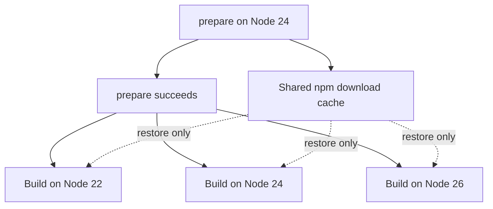
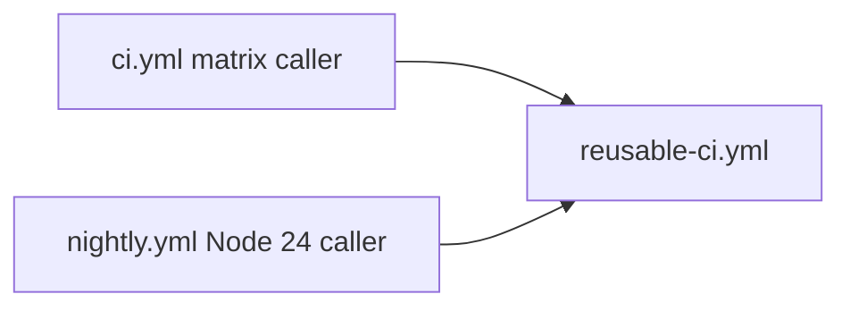

# Advanced GitHub Actions: Caching, Matrix Builds, and Reusable Workflows

A KTH DD2482 executable tutorial. **Estimated time: 30–40 minutes. Prerequisite: a free GitHub account.**

Complete every step on **github.com** in your own **public** repository. No local installation, terminal, secrets, or external application services are needed. Commands shown inside YAML run on GitHub's runners, not on your computer.

## Intended Learning Outcomes

By the end, you can:

- Add dependency caching to a GitHub Actions workflow.
- Explain cache keys, exact hits, restore keys, and invalidation.
- Create and reason about a Node.js matrix build.
- Share an npm download cache safely across matrix jobs.
- Extract CI logic into a reusable workflow and call it from two workflows.

## Motivation

Fresh CI runners repeatedly retrieve dependencies. Start with a basic build, add caching, test multiple Node versions, share the download cache across those jobs, then reuse the CI implementation across callers. The small statistics app keeps attention on these workflow changes.

The app summarizes `[2, 4, 6, 8]` and prints `{"count":4,"sum":20,"mean":5,"min":2,"max":8}`. TypeScript checks types separately; Webpack produces `app/dist/bundle.js`. The app makes no network requests; dependency installation retrieves packages from npm.

## Architecture overview

Basic caching keeps downloads between otherwise fresh runners:


The final matrix design has one cache writer and three readers:



The final callers share one implementation:



For this tutorial, standard `ubuntu-latest` runners are available free for public repositories. Each job gets a fresh virtual machine, so installed dependencies do not carry over automatically. [GitHub-hosted runners](https://docs.github.com/en/actions/reference/runners/github-hosted-runners).

## Setup

1. On the repository page, click **Use this template → Create a new repository**. [Template repository instructions](https://docs.github.com/en/repositories/creating-and-managing-repositories/creating-a-repository-from-a-template).
2. Choose a name, select **Public**, and create your repository.
3. Open **Actions** in your new repository.
4. Select **CI → Run workflow**, choose the default branch, and run the existing baseline CI. [Manual workflow runs](https://docs.github.com/en/actions/how-tos/manage-workflow-runs/manually-run-a-workflow).
5. Wait for completion, open the run's **Summary**, and record the install and total durations from the job's Markdown table.
6. Continue with **Step 1 - Dependency caching** below. The starter includes only baseline CI and the progress checker; all three tutorial steps initially reporting **Missing** is expected.

For later steps, edit workflow files using the pencil icon in **Code**, then choose **Commit changes** to your default branch. To copy a solution, open its file, view **Raw**, copy the YAML, and paste it into the stated `.github/workflows/` destination. To create a file, use **Add file → Create new file** and enter its full repository path.

A fork also works, but Actions can be disabled on forks until explicitly enabled; the template route is simpler here. [Enabling workflows](https://docs.github.com/en/actions/how-tos/manage-workflow-runs/disable-and-enable-workflows).

### Baseline YAML

This is the existing `.github/workflows/ci.yml`, shown for reference; no setup edit is needed:

```yaml
name: CI

on:
  push:
  workflow_dispatch:

jobs:
  build:
    runs-on: ubuntu-latest
    defaults:
      run:
        working-directory: app

    steps:
      - name: Start job timer
        working-directory: .
        run: echo "JOB_START=$(date +%s)" >> "$GITHUB_ENV"

      - name: Checkout repository
        uses: actions/checkout@v7

      - name: Setup Node.js 24
        uses: actions/setup-node@v7
        with:
          node-version: '24'
          package-manager-cache: false

      - name: Install dependencies
        run: |
          install_start=$(date +%s)
          npm ci
          echo "INSTALL_DURATION=$(( $(date +%s) - install_start )) seconds" >> "$GITHUB_ENV"

      - name: Lint
        run: npm run lint

      - name: Typecheck
        run: npm run typecheck

      - name: Test
        run: npm test

      - name: Build
        run: npm run build

      - name: Run the built application
        run: npm start

      - name: Write timing summary
        if: always()
        working-directory: .
        run: |
          total_duration=$(( $(date +%s) - JOB_START ))
          {
            echo "| Job | Cache | Install duration | Total duration |"
            echo "| --- | --- | --- | --- |"
            echo "| build | Not enabled | ${INSTALL_DURATION:-Not completed} | $total_duration seconds |"
          } >> "$GITHUB_STEP_SUMMARY"
```

The shell timestamps use `date +%s`; `$GITHUB_ENV` passes timings between steps. **Total duration** measures from the first timer step to the summary: it includes checkout and setup, but excludes queue time and later post-job cleanup. Each job records its own duration; it is not the whole workflow's elapsed time.

## Step 1 - Dependency caching

### What

Preserve npm's download cache with `actions/cache@v6`. It stores downloaded package data that npm can retrieve again; it is different from the installed `node_modules` tree. [npm cache documentation](https://docs.npmjs.com/cli/v11/commands/npm-cache/).

### Why

Restoring downloads can reduce repeated dependency retrieval. We do not cache `node_modules`: `npm ci` creates a clean installation from the lockfile and removes an existing dependency tree before installing. A download cache does not replace that installation. [npm ci documentation](https://docs.npmjs.com/cli/v11/commands/npm-ci/).

### Do

Replace `.github/workflows/ci.yml` with this complete [Step 1 snapshot](solutions/step-1-cache/ci.yml), then commit through github.com:

```yaml
name: CI

on:
  push:
  workflow_dispatch:

jobs:
  build:
    runs-on: ubuntu-latest
    defaults:
      run:
        working-directory: app

    steps:
      - name: Start job timer
        working-directory: .
        run: echo "JOB_START=$(date +%s)" >> "$GITHUB_ENV"

      - name: Checkout repository
        uses: actions/checkout@v7

      - name: Setup Node.js 24
        uses: actions/setup-node@v7
        with:
          node-version: '24'
          package-manager-cache: false

      - name: Get npm cache directory
        id: npm-cache
        run: echo "dir=$(npm config get cache)" >> "$GITHUB_OUTPUT"

      - name: Cache npm downloads
        id: cache-npm
        uses: actions/cache@v6
        with:
          path: ${{ steps.npm-cache.outputs.dir }}
          key: ${{ runner.os }}-npm-node-24-${{ hashFiles('app/package-lock.json') }}
          restore-keys: |
            ${{ runner.os }}-npm-node-24-

      - name: Install dependencies
        run: |
          install_start=$(date +%s)
          npm ci
          echo "INSTALL_DURATION=$(( $(date +%s) - install_start )) seconds" >> "$GITHUB_ENV"

      - name: Lint
        run: npm run lint

      - name: Typecheck
        run: npm run typecheck

      - name: Test
        run: npm test

      - name: Build
        run: npm run build

      - name: Run the built application
        run: npm start

      - name: Write timing summary
        if: always()
        working-directory: .
        env:
          CACHE_STATUS: ${{ steps.cache-npm.outputs.cache-hit == 'true' && 'Hit' || 'Miss' }}
        run: |
          total_duration=$(( $(date +%s) - JOB_START ))
          {
            echo "| Job | Cache | Install duration | Total duration |"
            echo "| --- | --- | --- | --- |"
            echo "| build | $CACHE_STATUS | ${INSTALL_DURATION:-Not completed} | $total_duration seconds |"
          } >> "$GITHUB_STEP_SUMMARY"
```

Read the new parts:

- `npm config get cache` discovers the configured cache directory; `$GITHUB_OUTPUT` exposes it as `steps.npm-cache.outputs.dir`. No path is hard-coded.
- `package-manager-cache: false` disables setup-node's automatic package-manager caching so the explicit cache step remains visible. Do not add its built-in `cache` input. [setup-node](https://github.com/actions/setup-node/tree/v7).
- `runner.os` separates operating systems. `node-24` makes this first example specific to Node.js 24.
- `hashFiles('app/package-lock.json')` ties the key to the locked dependency graph. Changing the lockfile changes the primary key: this is invalidation.
- `restore-keys` supplies a broader prefix to recover older downloads when the primary key is absent. `cache-hit == 'true'` means an exact primary-key hit; fallback restores still appear as **Miss** in our table. The combined cache action saves a new entry after a successful job when needed. [actions/cache](https://github.com/actions/cache/tree/v6).

Observe **two runs**: use the CI run triggered by your commit as the first, wait for it to finish, then choose **Actions → CI → Run workflow** for the second. Inspect the cache step's logs and summary each time. Keep the workflow and lockfile identical between those runs. If you repeat the exercise later, an existing cache may make both runs Hit.

### Expect

The first run normally reports **Miss** and the later identical run **Hit**, provided the cache was saved and remains available. `npm ci` runs in both cases. A small project may show only a small install-time improvement, and total time may increase even when install time decreases.

### Cache behavior notes

- Entries are immutable: updating cached contents requires a new key.
- Lookup depends on **key, cache version, and branch scope**. Version reflects cached paths and compression; runs can generally restore from their current or default branch, with additional pull-request rules.
- Current defaults are **10 GB per repository** and removal of entries unused for **over seven days**. Administrators can configure more storage, potentially with charges; 10 GB is not a universal permanent maximum. Capacity eviction removes least recently accessed entries.
- Cross-OS archives are not automatically portable. `enableCrossOsArchive` is opt-in and defaults to false; this tutorial stays on Ubuntu and retains OS in the key.

See the official [dependency caching reference](https://docs.github.com/en/actions/reference/workflows-and-actions/dependency-caching) for matching, scope, retention, and current limits.

## Step 2 - Matrix builds and shared caching

### Step 2a - Matrix

**What:** Run the same CI checks on Node.js 22, 24, and 26, all on `ubuntu-latest`.

**Why:** A passing run on one runtime does not prove the app and toolchain work on the others. `strategy.matrix` expands one job definition into three jobs. `fail-fast: false` lets the other matrix jobs continue if one fails. [Matrix strategy](https://docs.github.com/en/actions/how-tos/write-workflows/choose-what-workflows-do/run-job-variations).

**Do:** In the Step 1 file, add `strategy` immediately below `build`'s `runs-on`:

```yaml
    strategy:
      fail-fast: false
      matrix:
        node-version: [22, 24, 26]
```

Rename the setup step to `Setup Node.js` and replace its `with` section:

```yaml
        with:
          node-version: ${{ matrix.node-version }}
          package-manager-cache: false
```

Initially keep **separate per-cell caches**. Replace the cache key and restore prefix:

```yaml
          key: ${{ runner.os }}-npm-node-${{ matrix.node-version }}-${{ hashFiles('app/package-lock.json') }}
          restore-keys: |
            ${{ runner.os }}-npm-node-${{ matrix.node-version }}-
```

In `Write timing summary`, add `NODE_VERSION` beside the existing `CACHE_STATUS` environment variable:

```yaml
        env:
          NODE_VERSION: ${{ matrix.node-version }}
          CACHE_STATUS: ${{ steps.cache-npm.outputs.cache-hit == 'true' && 'Hit' || 'Miss' }}
```

Replace only the summary's data-row echo with:

```yaml
            echo "| build (Node $NODE_VERSION) | $CACHE_STATUS | ${INSTALL_DURATION:-Not completed} | $total_duration seconds |"
```

Keep every existing install, lint, typecheck, test, build, and start step. Commit and run CI.

**Expect:** Three jobs, each with its own Node version and summary. Their keys differ, so they have separate caches. Node 24 may already hit the cache created in Step 1. The matrix remains `[22, 24, 26]`; consult the [Node.js release schedule](https://github.com/nodejs/Release#release-schedule) for lifecycle information rather than assuming a version's status stays fixed.

### Step 2b - One cache shared across Node versions

**What:** Remove the Node version from the key, while preserving the three-job matrix.

**Why:** We cache package downloads, not runtime-specific installed dependencies. The setup-node documentation explicitly describes its global package-manager cache as reusable across Node.js versions. [Caching packages data](https://github.com/actions/setup-node/blob/v7/docs/advanced-usage.md#caching-packages-data).

**Do:** Replace the combined cache step's key and restore prefix:

```yaml
          key: ${{ runner.os }}-npm-${{ hashFiles('app/package-lock.json') }}
          restore-keys: |
            ${{ runner.os }}-npm-
```

Commit and run CI. To observe a **cold** cache, first wait for earlier CI runs to finish, then open **Actions → Caches** in your own tutorial repository and delete entries starting with `Linux-npm-`. This also removes older fallback entries. [Managing caches](https://docs.github.com/en/actions/how-tos/manage-workflow-runs/manage-caches).

**Expect:** All three jobs calculate the same key. On a cold parallel run, they may all miss, install independently, and attempt to create the same entry. A cache-save conflict warning is possible, not guaranteed.

**Our real cold shared-cache run:**

| Job | Cache | Install duration | Total duration |
| --- | --- | --- | --- |
| Node 22 | Miss | 3s | 11s |
| Node 24 | Miss | 4s | 13s |
| Node 26 | Miss | 4s | 19s |

**No cache-save conflict warning was observed.** These measurements show simultaneous misses; they do not demonstrate an observed save conflict.

### Step 2c - Centralized prepare job

**What:** Make `prepare` the only cache writer. Matrix jobs restore only.

**Why:** The matrix waits for a successful prepare job, so its jobs do not compete to save the shared key. `needs: prepare` expresses this dependency. [Job dependencies](https://docs.github.com/en/actions/reference/workflows-and-actions/workflow-syntax#jobsjob_idneeds).

**Do:** Replace `.github/workflows/ci.yml` with the complete [final Step 2 snapshot](solutions/step-2-matrix/ci.yml). Keep all timing summaries. The prepare job uses Node.js 24 with automatic caching disabled and implements these operations:

```yaml
      - name: Restore npm downloads
        id: cache-npm
        uses: actions/cache/restore@v6
        with:
          path: ${{ steps.npm-cache.outputs.dir }}
          key: ${{ runner.os }}-npm-${{ hashFiles('app/package-lock.json') }}
          restore-keys: |
            ${{ runner.os }}-npm-

      - name: Install dependencies
        run: |
          install_start=$(date +%s)
          npm ci
          echo "INSTALL_DURATION=$(( $(date +%s) - install_start )) seconds" >> "$GITHUB_ENV"

      - name: Save npm downloads
        if: steps.cache-npm.outputs.cache-hit != 'true'
        uses: actions/cache/save@v6
        with:
          path: ${{ steps.npm-cache.outputs.dir }}
          key: ${{ steps.cache-npm.outputs.cache-primary-key }}
```

These are excerpts from `prepare.steps`; use the snapshot for checkout, setup, cache-directory discovery, and timing. The save uses the restore action's resolved **primary key**, not a fallback key. Saving is conditional on no exact hit and on preceding steps succeeding.

The matrix job begins:

```yaml
  build:
    needs: prepare
    runs-on: ubuntu-latest
    strategy:
      fail-fast: false
      matrix:
        node-version: [22, 24, 26]
```

Its cache step uses `actions/cache/restore@v6` with the same shared key and prefix. It has no save step. Every matrix job still runs `npm ci`, lint, typecheck, tests, build, and start. The explicit [restore](https://github.com/actions/cache/tree/v6/restore) and [save](https://github.com/actions/cache/tree/v6/save) actions separate those responsibilities.

Commit and run CI. For a cold-run observation, clear your own tutorial cache as in Step 2b before starting the run.

**Expect:** `prepare` finishes first, then the three matrix jobs fan out. Our validated cold run produced:

| Job | Cache | Install duration | Total duration |
| --- | --- | --- | --- |
| prepare | Miss | 8s | 11s |
| Node 22 | Hit | 3s | 12s |
| Node 24 | Hit | 4s | 17s |
| Node 26 | Hit | 3s | 19s |

This assumes the save succeeds and the cache remains available; restore-only jobs can still install if it is unavailable. A prepare job introduces serial latency before fan-out, so it is not always the best trade-off for a very small matrix. Matrix **Total duration** excludes time waiting for `prepare`; compare the whole run's timeline separately.

## Step 3 - Reusable workflows

### What

Move the build implementation into `reusable-ci.yml`, enabled by `workflow_call`. Callers choose when to run it and supply a Node version; the reusable workflow owns its runner and steps.

This tutorial uses only an input, with no outputs or secrets. Reusable workflows can define outputs to return data to callers, and callers can pass secrets explicitly through `jobs.<job_id>.secrets`. In supported same-organization or enterprise cases, `secrets: inherit` passes available secrets to the directly called workflow. We intentionally use no secrets here. [Inputs, outputs, and secrets](https://docs.github.com/en/actions/how-tos/reuse-automations/reuse-workflows).

### Why

A second caller can use identical CI logic without copying build steps. Reusable workflows are called at the **job level**, so a directly calling job has `uses` and inputs, rather than its own `runs-on` or `steps`. [Reusable workflows](https://docs.github.com/en/actions/how-tos/reuse-automations/reuse-workflows).

### Do

1. Create `.github/workflows/reusable-ci.yml` in the browser by copying the [reusable snapshot](solutions/step-3-reusable/reusable-ci.yml). It has one required string input:

   ```yaml
   on:
     workflow_call:
       inputs:
         node-version:
           required: true
           type: string
   ```

   It uses `${{ inputs.node-version }}` in setup-node and the summary, restores the same npm download cache, and retains all checks and timing. It never saves a cache.

2. Replace `.github/workflows/ci.yml` with the [Step 3 caller snapshot](solutions/step-3-reusable/ci.yml). Its prepare job is unchanged, and its build job becomes:

   ```yaml
   build:
     needs: prepare
     strategy:
       fail-fast: false
       matrix:
         node-version: [22, 24, 26]
     uses: ./.github/workflows/reusable-ci.yml
     with:
       node-version: ${{ format('{0}', matrix.node-version) }}
   ```

   `format` converts the numeric matrix value to the required string. The local workflow path refers to `.github/workflows/` after copying; do not call a workflow from `solutions/`. [workflow_call input types](https://docs.github.com/en/actions/reference/workflows-and-actions/workflow-syntax#onworkflow_callinputs).

3. Create `.github/workflows/nightly.yml` by copying the [nightly snapshot](solutions/step-3-reusable/nightly.yml):

   ```yaml
   name: Nightly CI

   on:
     workflow_dispatch:
     schedule:
       - cron: '17 2 * * *'

   jobs:
     nightly:
       uses: ./.github/workflows/reusable-ci.yml
       with:
         node-version: '24'
   ```

4. Commit the files and run **Actions → CI → Run workflow**, then **Actions → Nightly CI → Run workflow**. Inspect their summaries and the app's JSON output.

### Expect

CI runs prepare followed by three reusable build invocations. Nightly runs only one reusable invocation with Node.js 24; it restores an available cache but does not prepare or save one. The daily schedule is **02:17 UTC**, runs on the default branch, and may be delayed; the manual trigger lets you test without waiting overnight. [Scheduled workflows](https://docs.github.com/en/actions/reference/workflows-and-actions/events-that-trigger-workflows#schedule).

For a workflow in another repository, the syntax is `owner/repository/.github/workflows/reusable-ci.yml@ref`. Production consumers should choose an appropriate immutable reference, preferably a commit SHA when strong immutability is required; branch and movable tag references can change. Our local reference selects the reusable workflow from the caller's commit. [Calling a reusable workflow](https://docs.github.com/en/actions/how-tos/reuse-automations/reuse-workflows#calling-a-reusable-workflow).

| Approach | Reuses | Practical difference |
| --- | --- | --- |
| Reusable workflow | Full workflows/jobs | Owns jobs and runners; accepts inputs and secrets when declared |
| Composite action | A sequence of steps | Runs inside the caller's job |
| Copy-paste | Repeated YAML text | Simplest initially, but leaves the most maintenance duplication |

See GitHub's [comparison of reusable configurations](https://docs.github.com/en/actions/concepts/workflows-and-actions/reusing-workflow-configurations).

## Results

Record your own results from the job summaries. Copy additional rows into your notes for each matrix version and prepare job; you can edit this table through github.com if desired.

| Scenario | Cache | Install duration | Total duration |
| --- | --- | --- | --- |
| Baseline | Not enabled | | |
| Cached first run | Miss | | |
| Cached second run | Hit | | |
| Per-cell matrix, Node ___ | | | |
| Shared matrix, Node ___ | | | |
| Centralized prepare | | | |
| Centralized matrix, Node ___ | | | |

### Our real measured examples

These are examples from real runs in this repository, not predictions for your run.

| Scenario | Job | Cache | Install duration | Total duration |
| --- | --- | --- | --- | --- |
| Baseline | build | Not enabled | 6s | 17s |
| First explicit-cache run | build | Miss | 5s | 12s |
| Second identical cached run | build | Hit | 4s | 15s |
| Step 2a: per-cell matrix | Node 22 | Miss | 7s | 21s |
| Step 2a: per-cell matrix | Node 24 | Hit | 5s | 16s |
| Step 2a: per-cell matrix | Node 26 | Miss | 6s | 21s |
| Step 2b: cold naive shared cache | Node 22 | Miss | 3s | 11s |
| Step 2b: cold naive shared cache | Node 24 | Miss | 4s | 13s |
| Step 2b: cold naive shared cache | Node 26 | Miss | 4s | 19s |
| Step 2c: cold centralized cache | prepare | Miss | 8s | 11s |
| Step 2c: cold centralized cache | Node 22 | Hit | 3s | 12s |
| Step 2c: cold centralized cache | Node 24 | Hit | 4s | 17s |
| Step 2c: cold centralized cache | Node 26 | Hit | 3s | 19s |

GitHub-hosted runner timing varies. These runs are observations, not a controlled benchmark: checkout, Node setup, cache transfer, and other work influence total time. Do not infer a guaranteed speedup or compare a matrix job's duration directly with the whole workflow's elapsed time. No cache-save conflict warning was observed in our Step 2b run.

## Design decisions

- **GitHub-native and browser-only:** Editing, execution, logs, and summaries stay on github.com.
- **Template repository:** Learners create their own public repository and experiment independently.
- **Download cache, not node_modules:** Keep clean installations while reusing package data.
- **Lockfile hash:** Dependency changes select a new cache key.
- **No Node version in the final shared key:** npm downloads can be reused across the validated runtimes.
- **OS stays in the key:** Keep archives within the same platform without opting into cross-OS sharing.
- **fail-fast is false:** Observe each runtime's result even if another fails.
- **Prepare is the single writer:** Separate population from parallel restoration within each CI run. This does not serialize independent workflow runs.
- **Explicit action major versions:** The validated examples use checkout/setup-node `@v7` and cache `@v6`, the selected current major versions for this tutorial in October 2026. Major tags receive updates and are not immutable SHA pins; stronger production pinning requires review of an exact commit.

## Reflection

Caching is useful for repeated dependency installation; matrices help test several CI variants. Reusable workflows help teams maintain repeated CI logic, and a prepare job can simplify cache ownership in larger matrices.

These techniques can be less useful for tiny projects, very fast or rarely installed dependencies, or a small matrix where the prepare delay costs more than it saves. Cache invalidation complexity can also outweigh the benefit. Caching speeds dependency retrieval, not necessarily extraction, installation scripts, linting, testing, or bundling; tiny repositories may show small timing differences.

Shared workflow changes affect all callers that pick up the changed reference. For workflows handling untrusted contributions or credentials, consider cache read/write trust carefully and never cache secrets: readable cache contents can be extracted, and untrusted writes can poison later runs. [Cache security guidance](https://docs.github.com/en/actions/reference/workflows-and-actions/dependency-caching#best-practices-for-using-caches-securely).

Reflect on your observations: Which duration changed? Would you keep prepare for this app? Which callers would be affected by changing the reusable build steps?

## Troubleshooting + solutions

| Problem | Check in the browser |
| --- | --- |
| Workflow does not appear | File is under `.github/workflows/`, YAML is valid, and changes are committed. For a manual run, the workflow must exist on the default branch and include `workflow_dispatch`. On a fork, enable Actions if prompted. |
| Cache always misses | Read the cache logs: compare OS, lockfile hash, path/version, and branch scope. Confirm a previous save succeeded. Retention or eviction can remove entries. Fallback restoration still displays Miss. |
| npm ci fails | Open the install log. Check that `app/package.json` and `app/package-lock.json` match and commands run in `app/`. For this tutorial, restore both supplied app files through the browser rather than hand-editing the lockfile. |
| Reusable workflow cannot be called | Confirm `workflow_call`, the `.github/workflows/` file location, and a job-level `uses` reference. Create the reusable file before committing a caller that references it. |
| Matrix value/input type issue | Keep the input `type: string` and pass `${{ format('{0}', matrix.node-version) }}`; for nightly use the quoted string `'24'`. |

Reference solution snapshots:

- [Step 1: basic cache](solutions/step-1-cache/ci.yml).
- [Step 2: matrix and centralized shared cache](solutions/step-2-matrix/ci.yml).
- [Step 3: reusable workflow and two callers](solutions/step-3-reusable/): [CI caller](solutions/step-3-reusable/ci.yml), [reusable CI](solutions/step-3-reusable/reusable-ci.yml), [nightly caller](solutions/step-3-reusable/nightly.yml).

These files are reference snapshots, not active workflows under `solutions/`. Copy their contents into `.github/workflows/` through the browser; Step 3's local references are written for that destination.

Open **Actions → Tutorial progress**, run it manually if needed, and inspect its summary. It reports Step 1 caching, Step 2 matrix + shared cache, and Step 3 reusable workflow. Missing steps receive hints and do not intentionally block or fail the learner. The checker uses simple text matches tailored to the tutorial's exact names and formatting, not a full YAML validator. With the final workflows in place, all three steps should show **Done**.

## References

- [GitHub: Dependency caching](https://docs.github.com/en/actions/reference/workflows-and-actions/dependency-caching).
- [GitHub: Managing caches](https://docs.github.com/en/actions/how-tos/manage-workflow-runs/manage-caches).
- [Official actions/cache v6](https://github.com/actions/cache/tree/v6).
- [Official actions/setup-node v7](https://github.com/actions/setup-node/tree/v7) and [advanced caching usage](https://github.com/actions/setup-node/blob/v7/docs/advanced-usage.md#caching-packages-data).
- [GitHub: Matrix strategy](https://docs.github.com/en/actions/how-tos/write-workflows/choose-what-workflows-do/run-job-variations).
- [GitHub: Job dependencies / needs](https://docs.github.com/en/actions/reference/workflows-and-actions/workflow-syntax#jobsjob_idneeds).
- [GitHub: Reusable workflows](https://docs.github.com/en/actions/how-tos/reuse-automations/reuse-workflows).
- [GitHub: workflow_call input syntax](https://docs.github.com/en/actions/reference/workflows-and-actions/workflow-syntax#onworkflow_callinputs).
- [GitHub: Template repositories](https://docs.github.com/en/repositories/creating-and-managing-repositories/creating-a-repository-from-a-template).
- [GitHub: Hosted runners](https://docs.github.com/en/actions/reference/runners/github-hosted-runners).
- [GitHub: Scheduled workflows](https://docs.github.com/en/actions/reference/workflows-and-actions/events-that-trigger-workflows#schedule).
- [Node.js: Release schedule](https://github.com/nodejs/Release#release-schedule).
- [npm: npm ci](https://docs.npmjs.com/cli/v11/commands/npm-ci/) and [npm cache](https://docs.npmjs.com/cli/v11/commands/npm-cache/).
